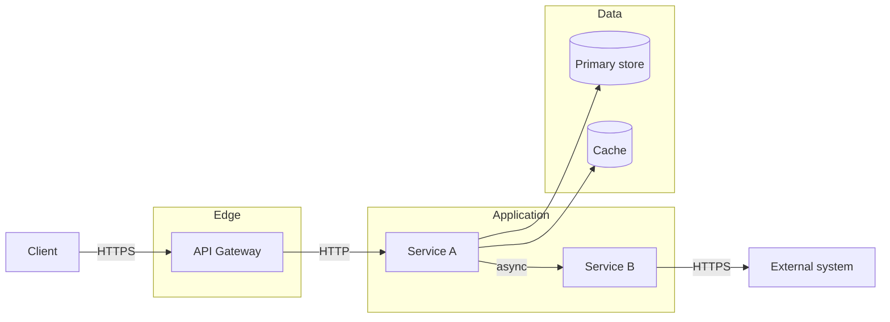
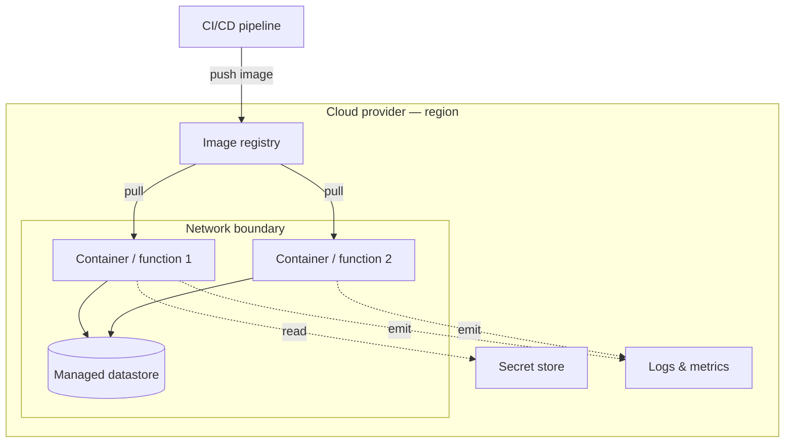
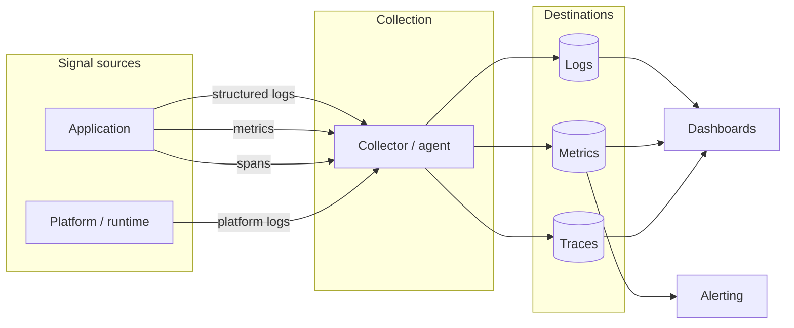

# Stack & Architecture Map

> The single view of this solution. If it is not on this page, it is not part of
> the architecture. Every approved architectural change updates this file in the
> same commit as the ADR that approves it.

- **Last verified:** `YYYY-MM-DD` — run the `cdad-audit` skill to refresh
- **Governing ADRs:** ADR-001

---

## 1. Stack at a glance

One row per layer. If a cell is empty, the decision has not been made — say so
rather than leaving a plausible guess in place.

| Layer | Technology | Version | Locked by |
|---|---|---|---|
| Language | | | |
| Runtime | | | |
| Application framework | | | |
| Compute model | | | |
| Datastore (primary) | | | |
| Datastore (cache) | | | |
| Messaging / events | | | |
| Identity & authz | | | |
| Secrets | | | |
| IaC | | | |
| CI/CD | | | |
| Observability | | | |
| Testing | | | |

"Locked by" points at the ADR that made the decision. A row with no ADR is a
decision nobody made on purpose — treat it as technical debt.

---

## 2. Component map

What talks to what, and over which protocol. Keep it to components that exist;
this is not a roadmap.

Label every edge with its protocol. An unlabelled edge is where paradigm drift
starts: sync and async look identical in a box diagram and behave nothing alike.

---

## 3. Deployment topology

Where each component actually runs, and what the trust boundaries are.

---

## 4. Observability

Where signals come from and where they land. This view answers "if it breaks at
3am, what do I look at" — keep it accurate or it is worse than absent.

| Signal | Emitted by | Collected via | Stored in | Retention |
|---|---|---|---|---|
| Logs | | | | |
| Metrics | | | | |
| Traces | | | | |
| Audit events | | | | |

**What is alerted on, and who receives it:**

| Condition | Threshold | Routed to |
|---|---|---|

An observability stack with no row in the alerting table is a dashboard nobody
watches. Record what actually pages someone.

---

## 5. Dependency rules

The boundaries the code must respect. This table is what makes drift
detectable — without it, "Service A calls the database directly" is an opinion.

| Module | May depend on | Must not depend on |
|---|---|---|
| | | |

---

## 6. Map change log

Every row here corresponds to an accepted ADR. If an architectural change
happened without a row, the governance loop was skipped.

| Date | ADR | What changed in this map |
|---|---|---|
| | | |

---
Governance: L0. Read-only for AI agents. Changes require an approved ADR and are
applied by the Solution Designer.
